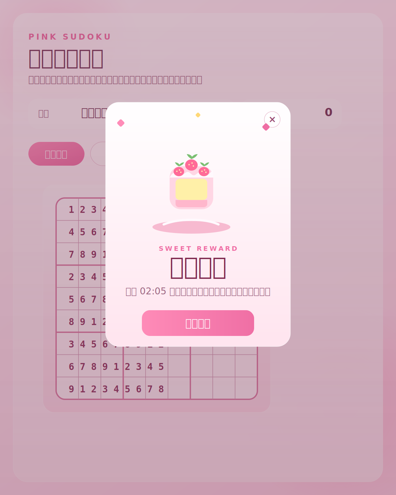

# 草莓數獨樂園

一個粉色系、可直接在瀏覽器玩的數獨小遊戲。

## 特色

- 粉色系介面設計
- 三種難度：甜甜簡單、莓果普通、櫻花挑戰
- 支援滑鼠點選與鍵盤輸入
- 提示、重來、檢查、解答功能
- 筆記模式
- 完成時會跳出草莓蛋糕獎勵視窗

## 線上遊玩

上傳到 GitHub 並開啟 GitHub Pages 後，網站網址會是：

- 專案頁面：`https://<你的 GitHub 帳號>.github.io/<repo 名稱>/`
- 如果 repo 名稱剛好是 `<你的 GitHub 帳號>.github.io`，網址會是：`https://<你的 GitHub 帳號>.github.io/`

## 本機開啟

直接打開 `index.html` 就可以開始玩。

## 專案檔案

- `index.html`：頁面結構
- `styles.css`：粉色系樣式與完成彈窗動畫
- `script.js`：數獨生成、遊戲邏輯與互動
- `celebration-preview.svg`：完成畫面預覽圖

## 上傳到 GitHub

如果你這台電腦目前沒有可用的 `git`，最簡單的方法是直接用 GitHub 網站上傳：

1. 在 GitHub 建立一個新的 repository。
2. 把這個資料夾中的檔案上傳到 repo 根目錄：
   - `index.html`
   - `styles.css`
   - `script.js`
   - `README.md`
   - `.nojekyll`
   - `.gitignore`
   - `celebration-preview.svg`
3. 上傳後到 repo 的 `Settings`。
4. 打開 `Pages`。
5. 在 `Build and deployment` 的 `Source` 選擇 `Deploy from a branch`。
6. Branch 選 `main`，資料夾選 `/ (root)`，然後儲存。
7. 等 GitHub 幾分鐘後發布完成，就能用公開網址遊玩。

## 預覽圖

